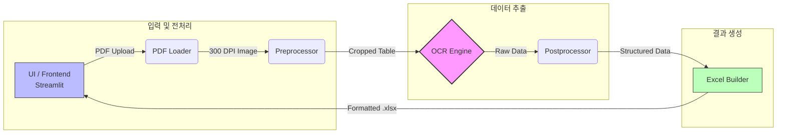

# 시스템 아키텍처 설계서

## 1. 시스템 개요

본 시스템은 회계 감사 과정에서 수기로 진행되던 '금융거래조회서'의 키인 작업을 자동화하여 업무 효율성을 높이고 휴먼 에러를 최소화하기 위해 개발하였습니다.
사용자가 PDF 형태의 금융거래조회서를 업로드하면, 시스템이 문서를 이미지로 변환하고 전처리 과정을 거친 후 OCR(광학 문자 인식)을 통해 표 데이터를 추출하여 지정된 엑셀 템플릿 파일로 반환합니다.

## 2. 전체 시스템 파이프라인

시스템은 단방향 데이터 파이프라인 구조를 가지며, 각 단계는 독립적인 모듈로 구성되어 있습니다.

1. **입력 및 UI 계층:** 사용자가 Streamlit 웹 인터페이스를 통해 PDF를 업로드하고 OCR 적용 페이지를 설정합니다.
2. **문서 변환 (PDF Loader):** 업로드된 PDF 파일을 OpenCV 처리가 가능한 300 DPI 고해상도의 BGR 이미지 배열(np.ndarray)로 변환합니다. (파일명 규칙에 따른 회사명/조회처 추출 병행)
3. **이미지 전처리 (Preprocessor):** 변환된 이미지에서 노이즈를 제거하고 표 영역을 특정하여 OCR 인식률을 극대화합니다.
4. **텍스트 추출 (OCR Engine):** 전처리된 이미지에서 텍스트와 좌표(Bounding Box) 데이터를 추출하여 내부 표준 구조로 반환합니다.
5. **데이터 후처리 및 검증 (Postprocessor):** 추출된 텍스트의 좌표를 기반으로 행/열을 그룹화하고, 오인식된 문자를 보정하며 다중 페이지에 걸친 표를 병합합니다.
6. **엑셀 생성 (Excel Builder):** 조회처 유형에 맞는 템플릿을 로드하고, 규격화된 데이터를 매핑하여 최종 엑셀 파일을 생성합니다.

## 3. 핵심 컴포넌트 상세

### 3.1 `src/core/pdf_loader.py`

* **역할:** PDF 파일 입력 처리 및 해상도 변환.
* **주요 기능:**
  * PDF 확장자, 최대 크기(300MB), 비밀번호 여부 등 예외 처리 (FUNC-001).
  * 파일명에서 '감사대상회사', '조회처', '조회처 유형' 자동 추출 (FUNC-002).

### 3.2 `src/core/preprocessor.py`

* **역할:** OCR 인식률 향상을 위한 이미지 최적화.
* **주요 기능:**
  * 그레이스케일 변환 및 2배 업스케일링.
  * 적응형 이진화 및 영역 팽창(3회 반복) 적용.
  * 페이지 면적의 1% 이상인 외곽선을 탐지하여 표 영역 크롭.
  * 표 내부 세로선 탐지 및 흰색 덮어쓰기 적용.
  * 문서 읽기 순서(위->아래, 좌->우) 기반 정렬 (FUNC-003).

### 3.3 `src/core/ocr_engine.py`

* **역할:** 이미지 텍스트 추출.
* **주요 기능:**
  * 광학 문자 인식을 수행하고, 프레임워크 종속성을 없애기 위해 출력 데이터를 내부 표준 인터페이스 구조로 정규화 (ADR-008).

### 3.4 `src/core/postprocessor.py` & `src/utils/`

* **역할:** 비정형화된 OCR 데이터의 논리적 구조화 및 보정.
* **주요 기능:**
  * 페이지를 초과하여 이어지는 표 처리 시, 속성 개수를 비교하여 동일 표 여부 판단 및 병합 (ADR-007).
  * 유사 문자 보정 및 의도된 공란에 대한 예외 처리 (REQ-F-004, REQ-F-005).

## 4. 기술 스택 및 도입 배경 (Technology Stack & ADR)

* **프론트엔드 (UI): `Streamlit`
* **선정 사유:** React, Django 등의 대안 대비 데이터 파이프라인 결과를 빠르게 화면으로 구성하고 프로토타이핑하는 데 최적화되어 있어 채택되었습니다 (ADR-002).

* **PDF 처리: `pdfplumber`
* **선정 사유:** 텍스트 추출과 이미지 변환에 널리 쓰이는 PyMuPDF는 속도가 빠르나 AGPL 라이선스로 상용화 리스크가 존재합니다. MIT 라이선스로 법적 제약이 없는 pdfplumber를 채택하였습니다 (ADR-001).

* **컴퓨터 비전: `OpenCV (cv2)`
* **선정 사유:** 그레이스케일, 이진화, 외곽선 탐지 등 이미지 전처리 파이프라인의 핵심 로직(FUNC-003)을 수행하기 위한 표준 라이브러리입니다.

* **OCR 엔진: `PaddleOCR`
* **선정 사유:** 회계 감사 절차에 가장 알맞은 프레임워크를 결정하기 위해 개발 과정에서 EasyOCR, Tesseract 등과 숫자 인식과 복잡한 표 인식 성능을 비교 테스트하였고, 가장 높은 정확도와 성능을 보여 최종 채택되었습니다 (ADR-003, ADR-006).

---
